<code>// t0xicVybez</code>

 

**I build automation, Discord bots, and developer tools that solve real problems.**
*Everything here is open source, and most of it is running in production somewhere.*

 

 

---

### `01.` &nbsp;About

  

---

### `02.` &nbsp;Featured Work

<!-- FEATURED:START -->
<table><tr><td width="100%">

#### [ArkenBot](https://github.com/t0xicVybez/ArkenBot)

ArkenBot — Discord bot with dashboard

  

</td></tr></table>

<table><tr><td width="100%">

#### [GameQuery](https://github.com/t0xicVybez/GameQuery) &nbsp;·&nbsp; [**Live**](https://query.arkenbot.app)

Zero-dependency game server query library for PHP and Node/TypeScript — A2S/Source, Minecraft, FiveM, Palworld, SA-MP and 23 protocol families across 53 games, with 1:1 matching ports.

    

</td></tr></table>
<!-- FEATURED:END -->

---

### `03.` &nbsp;Published Packages

Libraries you can install today. Counters are live.

<!-- PACKAGES:START -->
| Registry | Package | Source | |
|---|---|---|---|
| npm | [`@t0xicvybez/gamequery`](https://www.npmjs.com/package/@t0xicvybez/gamequery) | [GameQuery](https://github.com/t0xicVybez/GameQuery) |   |
| Packagist | [`t0xicvybez/gamequery`](https://packagist.org/packages/t0xicvybez/gamequery) | [GameQuery](https://github.com/t0xicVybez/GameQuery) |   |
<!-- PACKAGES:END -->

---

### `04.` &nbsp;Everything Else

<!-- PROJECTS:START -->
| Project | What it does | Stack | |
|---|---|---|---|
| [**Arken-Docs**](https://github.com/t0xicVybez/Arken-Docs) | ArkenBot Documentation | `TypeScript` | ★ 1 |
<!-- PROJECTS:END -->

<!-- UPDATED:START -->
3 public projects · list refreshed automatically 2026-07-22
<!-- UPDATED:END -->

---

### `05.` &nbsp;GitHub Stats

&nbsp;

&nbsp;

---

<code>● Building in the open &nbsp;·&nbsp; Rocklin, CA</code>

